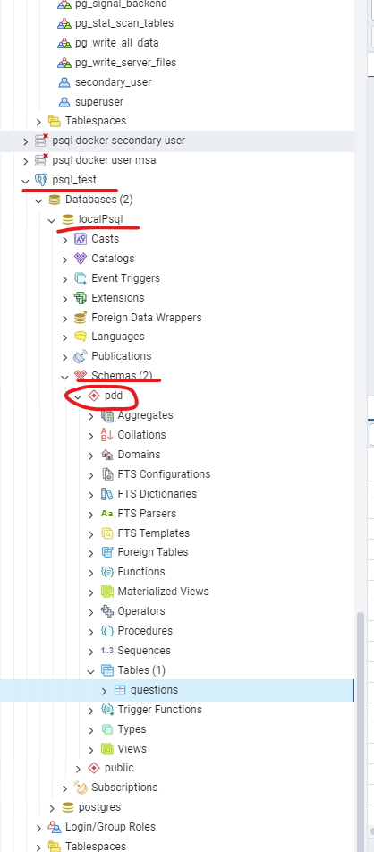

Сначала надо поднять postgre в docker, файл docker-compose.yaml лежит в дериктории psqlDockerCompose
Затем подключиться к БД например через pgAdmin
До первого запуска spring boot приложения, обязательно в БД postgres надо руками содать схему и назвать ее 'pdd'
После успешного создания схемы, надо запустить spring boot риложение, затем в браузере ввеста в адресную строку http://localhost:8080



Чтобы в БД не затрались данные при каждом запуске spring boot приложения, в application.yml 
у конфига spring.jpa.hibernate.ddl-auto надо проставить update, что бы вернуть зачистку при каждом запуске, проставить create
```yaml
spring:
  jpa:
    hibernate:
      ddl-auto: update
```

Что бы изменить количество вопросов в тесте, надо проставить в application.yaml нужную цифру, см ниже
```yaml
spring:
  application:
    question-test-count: 3
```

Вероятность выбора вопроса по самой слабой категории у пользователя задается в процентах в конфиге, см ниже:
```yaml
spring:
  application:
    weak-category-answer-probability-percent: 70
```
т.е. в данном случае вопросы из самой слабой категории будут выбираться с вероятностью 70%